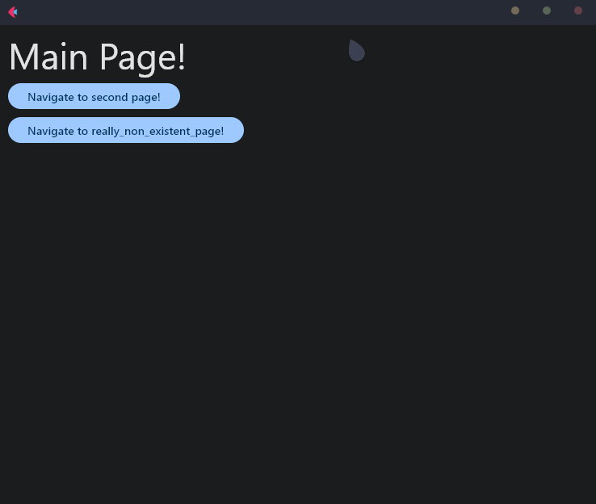

<h1 align="center">FletNavigator V2.0.1</h1>
<i><p align="center">Simple and fast navigator (router) for Flet (Python) that allows you to create multi-page applications! [<code>pip install flet_navigator</code>].<br><b>[<a href="https://github.com/xzripper/flet_navigator/blob/main/flet-navigator-docs.md">DOCUMENTATION</a>].</b></p>
<p align="center">Using Example:

```python
from flet import app, Page, Text, FilledButton, TextThemeStyle

from flet_navigator import VirtualFletNavigator, Any, ROUTE_404

from random import randint


# Main page content.
# page - Current page,
# navigator - With this you can navigate to other pages,
# args - Arguments sent from other page.
# Using these all typehints is optional.
def main_page(page: Page, navigator: VirtualFletNavigator, args: tuple[Any]) -> None:
    page.add(Text('Main Page!', style=TextThemeStyle.DISPLAY_MEDIUM))

    if args:
        page.add(Text(f'Message from {args[0]}: {args[1]}.'))

    page.add(
        FilledButton(
            'Navigate to second page!',

            on_click=lambda _: navigator.navigate('second_page', page, ('main page', 'Hello from main page!')) # Navigate to 'second_page', and send greetings from main page as arguments!
        )
    )

    page.add(
        FilledButton(
            'Navigate to really_non_existent_page!',

            on_click=lambda _: navigator.navigate('really_non_existent_page', page) # Navigate to non-existent page. Will result route_404.
        )
    )

# Second page content.
def second_page(page: Page, navigator: VirtualFletNavigator, args: tuple[Any]) -> None:
    page.add(Text('Second Page!', style=TextThemeStyle.DISPLAY_SMALL))

    page.add(Text(f'Message from {args[0]}: {args[1]}'))

    page.add(
        FilledButton(
            'Navigate to main page!',

            on_click=lambda _: navigator.navigate('/', page, ('second page', randint(1, 100))) # Navigate to main page, and send random number as arguments!
        )
    )

# 404 page content.
def route_404(page: Page, navigator: VirtualFletNavigator, args: tuple[Any]) -> None:
    page.add(Text('How did you get here? There is no page like this registered in routes...'))

    page.add(
        FilledButton(
            'Navigate to the main page until it is too late...',

            on_click=lambda _: navigator.navigate('/', page) # Navigate to main page.
        )
    )

# Main function. Being used only for routing.
def main(page: Page) -> None:
    # Initialize navigator.
    flet_navigator = VirtualFletNavigator(
        {
            '/': main_page, # Specify main page,
            'second_page': second_page, # Specify second page,
            ROUTE_404: route_404 # Specify 404 page (optional).
        }, lambda route: print(f'Route changed!: {route}') # On route changed handler (optional).
    )

    flet_navigator.render(page) # Render main page.

app(target=main) # Run main fuction.
```

</p>

<p align="center"></p>

~~There is no documentation, or more examples, because you can use FletNavigator just by researching this small example! Also every function, and class field has own docstring.<br>
This example will be updated in next releases to keep everything up to date.~~

See the difference between ```VirtualFletNavigator``` and ```FletNavigator```, and more <a href="https://github.com/xzripper/flet_navigator/blob/main/flet-navigator-docs.md">here</a> (<- documentation).

<hr>
<p align="center">FletNavigator v2.0.1.</p></i>
