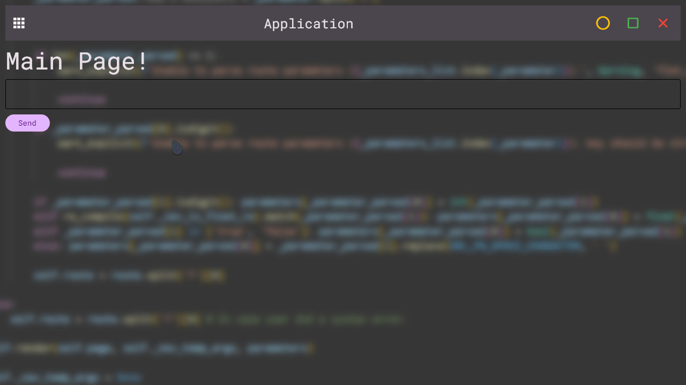

<h1 align="center">FletNavigator<br>   </h1>
<p align="center"><br><i>FletNavigator & <a href="https://github.com/xzripper/flet_restyle">FletReStyle</a>.</i></p>
<p align="center">Simple and fast navigator (router) for Flet (Python) that allows you to create multi-page applications! [<code>pip install flet_navigator</code>].<br><b>[<a href="https://github.com/xzripper/flet_navigator/blob/main/flet-navigator-docs.md">DOCUMENTATION</a>].</b></p>
<p align="center">Using Example:

```python
from flet import app, Page, Text

from flet_navigator import VirtualFletNavigator, route, PageData, ROUTE_404


@route('/')
def main_page(pg: PageData) -> None:
   pg.add(Text('Main Page!')) # or pg.page.add

@route('second_page')
def second_page(pg: PageData) -> None:
   ... # Second page content.

@route(ROUTE_404)
def route_404(pg: PageData) -> None:
   ... # 404 Page Content.

def main(page: Page) -> None:
   # Initialize navigator.
   flet_navigator = VirtualFletNavigator()

   flet_navigator.render(page) # Render current page.

app(target=main)
```

</p>

<p align="center"></p> <p align="center"><i>(Deprecated Example GIF).</i></p>

See the difference between ```VirtualFletNavigator``` and ```FletNavigator```, and more <a href="https://github.com/xzripper/flet_navigator/blob/main/flet-navigator-docs.md">here</a> (<- documentation).

<hr>
<p align="center">FletNavigator v2.5.5.</p></i>
