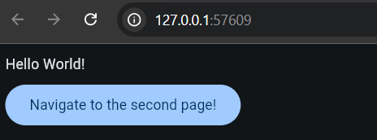

<h1 align="center"><b>⚡ FletNavigator V3</b></h1>
<p align="center">

</p><p align="center"><b>FletNavigator is a simple yet effective library made to handle navigation in Flet apps incredibly quickly. Effective management of both virtual and public routes are guaranteed by its lightweight architecture. Complex navigation situations are made simpler by its support for dynamic page rendering, URL parameters, and configurable route change callbacks. With built-in 404 error handling and hierarchical and parameterised routes, FletNavigator shines. Building responsive and reliable Flet-based applications is made easier with its user-friendly design and performance optimisation.</b></p>

<p align="center"></p>

<b>

```python
from flet import app, Text, FilledButton

from flet_navigator import PublicFletNavigator, PageData, route


@route('/')
def main(pg: PageData) -> None:
    pg.add(Text('Hello World!'))

    pg.add(FilledButton('Navigate to the second page!', on_click=lambda _: pg.navigate('second')))

@route
def second(pg: PageData) -> None:
    pg.add(Text('I am the second page!'))

    pg.add(FilledButton('Return to the homepage!', on_click=lambda _: pg.navigate_homepage()))

app(lambda page: PublicFletNavigator(page).render(page))
```
</b>

<p align="center"><a href="https://github.com/xzripper/flet_navigator/blob/main/flet-navigator-docs.md"><b>See the documentation.</b></a></p>

<hr><p align="center"><b>FletNavigator V3.8.5</b></p>
